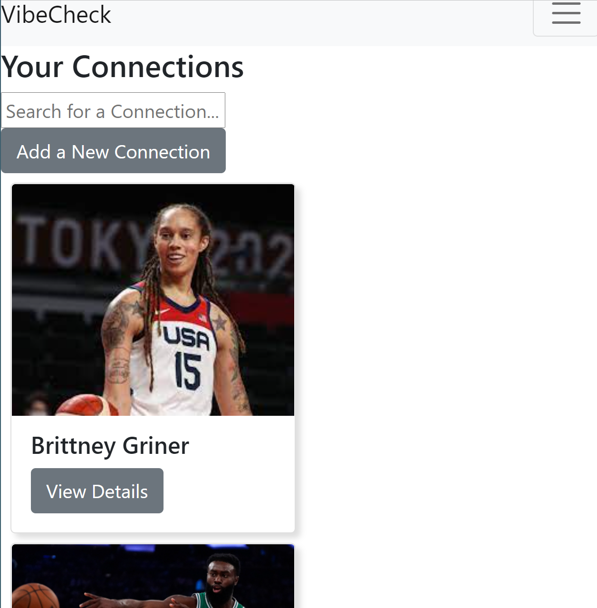
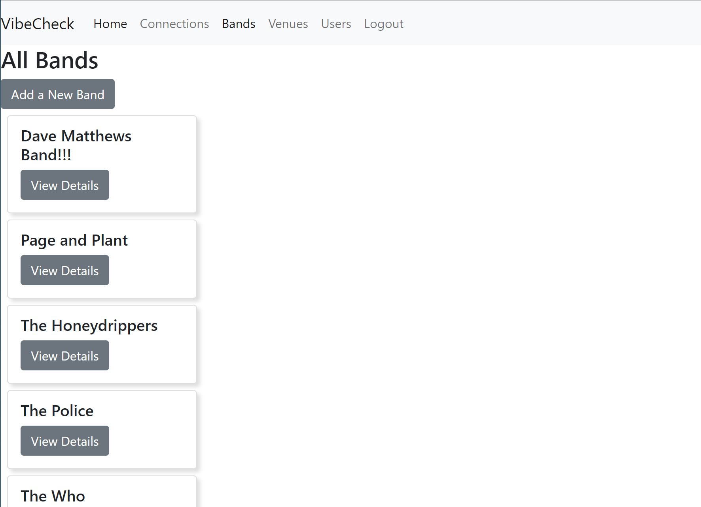
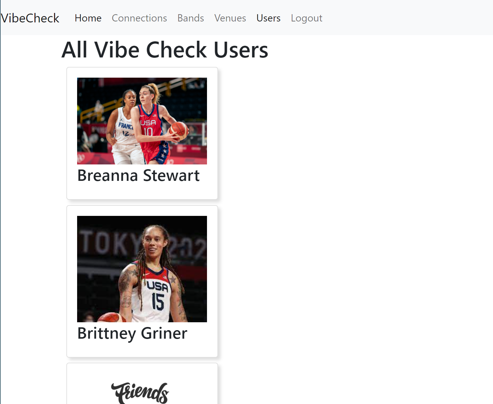

# VibeCheck - Fullstack

## Getting Started

1. Pull down this repo

1. Run the two scripts that are in the SQL folder. These will create the VibeCheck database and add some test data.

1. Then Create your own Firebase project.
1. - Go to [Firebase](https://console.firebase.google.com/u/0/) and add a new project. You can name it whatever you want (VibeCheck is a good name)
   - Go to the Authentication tab, click "Set up sign in method", and enable the Username and Password option.
   - Add at least two new users in firebase. Use email addresses that you find in the UserProfile table of your SQL Server database
   - Once firebase creates a UID for these users, copy the UID from firebase and update the `FirebaseUserId` column for the same users in your SQL Server database.
   - Click the Gear icon in the sidebar to go to Project Settings. You'll need the information on this page for the next few steps

1. Go to the `appSettings.Local.json.example` file. Replace the value for FirebaseProjectId with your own

1. Open your `client` directory in VsCode. Open the `.env.local.example` file and replace `__YOUR_API_KEY_HERE__` with your own firebase Web API Key

1. Install your dependencies by running `npm install` from the same directory as your `package.json` file

1. Install Cloudinary by running `npm install cloudinary` from the same directory as your `package.json` file

1. 1. Install bootstrap by running `npm install bootstrap` from the same directory as your `package.json` file

1. 1. Install axios by running `npm install axios` from the same directory as your `package.json` file

### Login Page

### Register Page

### Home Page

### Connection Detail Page

### Bands Page

### Users Page

### Venues Page

